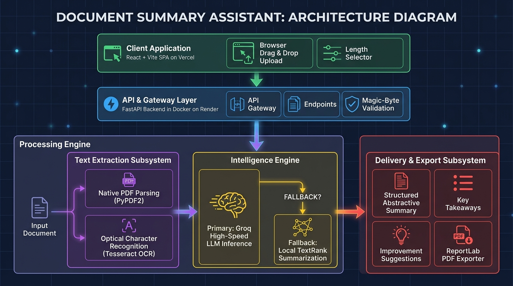
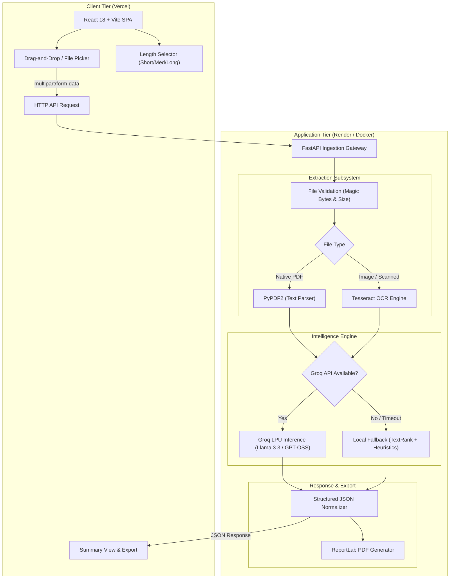

# Document Summary Assistant

An AI-powered web application that accepts documents (PDFs or scanned images), extracts the content via text parsing or OCR, and generates intelligent, auto-tailored summaries, key takeaway points, document-type classification, and actionable improvement suggestions.

---

## 📌 Approach Write-Up (Technical Assessment)

> **Approach (200 words max):**
> 
> The Document Summary Assistant implements a multi-stage, resilient document processing architecture designed for high accuracy and minimal latency. When a user uploads a document (PDF or scanned image), the ingestion layer validates magic bytes and file limits before routing the payload. Native PDFs are parsed page-by-page via `PyPDF2`, while scanned images and image-based PDFs automatically trigger `Tesseract OCR` for robust optical character extraction.
>
> For analysis, the extracted text is processed using a cloud-optimized LLM via Groq's high-speed inference engine, generating abstractive summaries, verbatim key sentences, document-type classification with confidence scoring, and tailored improvement suggestions in a single structured JSON transaction. A resilient local fallback pipeline (using `TextRank` graph algorithms and heuristic classifiers) activates automatically if API connectivity is unavailable, ensuring continuous service.
>
> The frontend is built with React 18, Vite, and Tailwind CSS, featuring drag-and-drop ingestion, real-time loading states, summary length selectors (short/medium/long), light/dark mode, and one-click exports to formatted PDF and plain text. The solution is containerized with Docker for deployment on Render and Vercel.

---

## 🚀 Features

- **Document Upload**: Multi-file drag-and-drop or file picker (PDF, PNG, JPG, JPEG, TIFF, BMP) with client- and server-side size/type validation.
- **Dual Text Extraction**: Native PDF parsing with format preservation and Optical Character Recognition (OCR) via Tesseract for scanned documents.
- **Smart Summarization**: High-fidelity abstractive summaries generated at custom lengths (*Short*, *Medium*, *Long*).
- **Key Takeaways**: Highlights core verbatim points directly extracted from the original text.
- **Document Classification**: Auto-detects document types (e.g., Resume, Contract, Research Paper, Invoice, Report) with confidence scoring.
- **Improvement Suggestions**: Actionable recommendations tailored to improve content clarity, structure, and impact.
- **Export Capabilities**: One-click download as a styled PDF report or plain text, plus instant clipboard copy.
- **Modern UI/UX**: Clean, responsive layout (desktop/tablet/mobile) with dark/light theme persistence.

---

## 🏗️ System Architecture



### Architectural Flow Diagram



---

### Layer-by-Layer Architectural Breakdown

```
┌─────────────────────────────────────────────────────────────────────────────┐
│ 1. PRESENTATION LAYER (React + Vite + Tailwind CSS)                         │
│    • Client-side file type & 10MB size validation before upload             │
│    • Granular summary length controls (Short: ~3-4, Med: ~7, Long: ~12)     │
│    • Asynchronous loading states and error boundaries                       │
│    • Responsive UI with dark/light mode persistence and export actions      │
└──────────────────────────────────────┬──────────────────────────────────────┘
                                       │ POST /api/summarize (multipart/form-data)
┌──────────────────────────────────────▼──────────────────────────────────────┐
│ 2. INGESTION & GATEWAY LAYER (FastAPI + Pydantic)                           │
│    • Magic-byte verification via puremagic (detects disguised extensions)   │
│    • Non-blocking async I/O with Starlette threadpool offloading            │
│    • Global exception handling with uniform JSON error schemas              │
└──────────────────────────────────────┬──────────────────────────────────────┘
                                       │
┌──────────────────────────────────────▼──────────────────────────────────────┐
│ 3. EXTRACTION SUBSYSTEM                                                     │
│    • Native PDF: High-speed page-by-page text extraction via PyPDF2         │
│    • Scanned Images/PDFs: Optical Character Recognition (OCR) via Tesseract │
│    • Automatic fallback to OCR if extracted PDF text is sparse/scanned      │
└──────────────────────────────────────┬──────────────────────────────────────┘
                                       │ Extracted Text Stream
┌──────────────────────────────────────▼──────────────────────────────────────┐
│ 4. INTELLIGENCE ENGINE (Dual-Path Processing)                               │
│    • Primary: Cloud-accelerated Groq LPU inference delivering single-pass:  │
│        - Abstractive smart summaries                                        │
│        - Document classification & confidence scoring                       │
│        - Verbatim key takeaway sentences                                    │
│        - Actionable document improvement suggestions                        │
│    • Fallback: Zero-dependency local pipeline (TextRank graph algorithm     │
│      + keyword pattern matching) if API limits or connectivity drop         │
└──────────────────────────────────────┬──────────────────────────────────────┘
                                       │
┌──────────────────────────────────────▼──────────────────────────────────────┐
│ 5. EXPORT & ARTIFACT GENERATION                                             │
│    • ReportLab PDF generator compiling clean styled report cards            │
│    • Formatted plain text (.txt) generator & system clipboard exporter      │
└─────────────────────────────────────────────────────────────────────────────┘
```

---

## 🛠️ Tech Stack

- **Frontend**: React 18, Vite, Tailwind CSS, Axios, React Icons, React Dropzone.
- **Backend**: Python 3.11+, FastAPI, Uvicorn, Pydantic, python-multipart.
- **AI/ML & Extraction**: Groq Python SDK, PyPDF2, Pytesseract (Tesseract OCR), Pillow, Sumy (TextRank), NLTK.
- **Export & Storage**: ReportLab, PureMagic.
- **Deployment**: Docker, Render (Backend API), Vercel (Frontend).

---

## 💻 Local Setup & Execution

### Prerequisites
- Python 3.10+
- Node.js 18+ and npm
- Tesseract OCR installed on your system (optional for native PDFs, required for images)

---

### 1. Backend Setup

```bash
# Navigate to backend directory
cd backend

# Create and activate virtual environment
python -m venv venv

# Windows:
venv\Scripts\activate
# macOS/Linux:
# source venv/bin/activate

# Install dependencies
pip install -r requirements.txt

# Configure environment
cp .env.example .env
# Edit .env and insert your free Groq API key:
# GROQ_API_KEY=gsk_...

# Start the backend server
uvicorn app.main:app --host 0.0.0.0 --port 8000 --reload
```

Backend API will be live at: **`http://localhost:8000`**  
Interactive API Docs (Swagger): **`http://localhost:8000/docs`**

---

### 2. Frontend Setup

```bash
# Navigate to frontend directory
cd frontend

# Install npm dependencies
npm install

# Start the Vite development server
npm run dev
```

Frontend application will be live at: **`http://localhost:5173`**

---

## 🌐 Deployment Guide

### Backend on Render
1. Create a **New Web Service** on [Render](https://render.com).
2. Connect your GitHub repository and select the `backend` folder as the root directory.
3. Choose **Docker** as the runtime (Render will automatically detect `backend/Dockerfile`).
4. Set Environment Variable in Render Dashboard:
   - `GROQ_API_KEY`: your Groq API key.
5. Deploy service.

### Frontend on Vercel
1. Import your repository on [Vercel](https://vercel.com).
2. Set Root Directory to `frontend`.
3. Add Environment Variable:
   - `VITE_API_URL`: `https://<your-render-backend-app>.onrender.com`
4. Deploy project.

---

## 🧪 Testing

Run backend tests:
```bash
cd backend
python -m pytest tests/ -v
```
